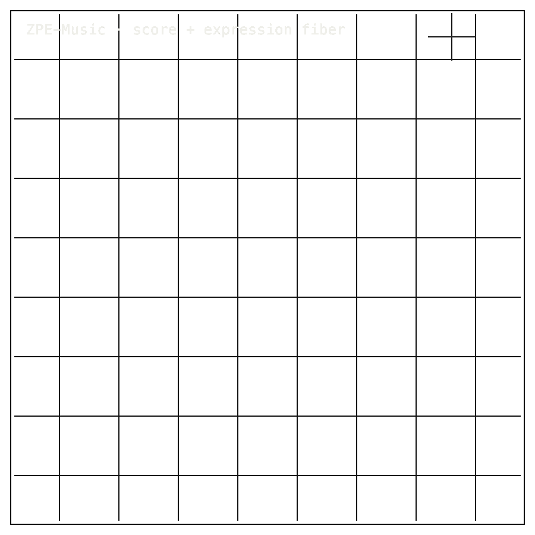

# ZPE-Music

## Install / Developer Commands

<!-- INSTALL-DX:START -->
#### Package Install

Installable package: `python3.11 -m pip install zpe-music`.
Current release: `0.1.0` on [PyPI](https://pypi.org/project/zpe-music/).
Source: [Zer0pa/ZPE-Music](https://github.com/Zer0pa/ZPE-Music/).

```bash
python3.11 -m pip install zpe-music
```

Import smoke:

```bash
python3.11 - <<'PY'
import importlib.metadata as md
import zpe_music

print("zpe-music", md.version("zpe-music"))
PY
```

Install success only proves package acquisition/import. Product scope, stale PyPI state, platform limits, and blockers remain in the front-door sections below.
- PyPI copy is stale or pending refresh; install success is not product readiness.
<!-- INSTALL-DX:END -->

#### Quick Start

```bash
python3 -m venv .venv
. .venv/bin/activate
python -m pip install --upgrade pip
python -m pip install -e '.[dev]'
python validation/run_release_verification.py
python -m pytest -q tests/test_music_authority_roundtrip.py tests/test_music_expression_authority_roundtrip.py tests/test_music_authority_guardrails.py
```

<table width="100%">
<tr>
<td width="100%" valign="top">
<div><span><b>00 · ZPE-MUSIC</b> · SYMBOLIC SCORE CODEC</span> <span>DEVELOPER-READY · REAL-CORPUS OPEN</span></div>
      <h1>Encoding the music <span>inside music</span></h1>
      <p>The score codec — what the composer wrote, not what the orchestra played · ZPE-Music · PyPI <em>zpe-music</em> 0.1.0 · github.com/Zer0pa/ZPE-Music</p>
      <p>A recording captures what an orchestra sounded like on one Tuesday night. A score captures what the composer meant — every event, voice, articulation and expression beneath the sound. Every audio codec eats the score and emits a waveform. ZPE-Music does the opposite: it encodes the score itself. On the declared MusicXML score surface, all six exactness axes resolve at <strong>1.0</strong> under <strong>11/11</strong> release checks. Real-corpus work against MuseScore and IMSLP catalogues is active, not done.</p>
</td>
</tr>
</table>

<table width="100%">
<tr>
<td width="100%" valign="top">
<figure>
        <div></div>
        <figcaption><b>Scope:</b> declared MusicXML score surface. Audio, MIDI rendering, performance state, and real-corpus closure remain open.</figcaption>
      </figure>
</td>
</tr>
</table>

<table width="100%">
<tr>
<td width="100%" valign="top">
<div><b>01 · THE GAP</b> <span>SCORE BECOMES SOUND</span></div>
      <h2>When a score is encoded as a waveform, the composer's intention disappears — it can't come back.</h2>
</td>
</tr>
</table>

<table width="100%">
<tr>
<td width="100%" valign="top">
<div><b>02 · MARKETS</b> <span>ADJACENT FORECASTS</span></div>
      <div>
        <div>
          <div><span>Music publishing</span>  <span>'32 · $13.7B</span></div>
          <div><span>Music publishing</span>  <span>'30 · $10.8B</span></div>
          <div><span>Digital sheet music</span>  <span>'34 · $4.2B</span></div>
          <div><span>Music education software</span>  <span>est. $3.4B</span></div>
          <div><span>Rights management / score archive</span>  <span>est. $1.2B</span></div>
        </div>
      </div>
      <div>Symbolic-score archives have no published analyst category — <b>MusicXML volume sits inside music-publishing and rights-management forecasts.</b></div>
</td>
</tr>
</table>

<table width="100%">
<tr>
<td width="50%" valign="top">
<div><b>03 · VALUE OF MARKET</b></div>
      <div>$10.8<span>B</span></div>
      <div>Music publishing grows; the symbolic-score archive sits <b>unpriced inside publisher and rights workflows.</b></div>
</td>
<td width="50%" valign="top">
<div><b>04 · INSIGHT</b></div>
      <h2>A waveform keeps the sound. A score keeps <span>the music.</span></h2>
</td>
</tr>
</table>

<table width="100%">
<tr>
<td width="50%" valign="top">
<div><b>05.1 · CURRENT TECH</b> <span>CODECS EAT THE SCORE</span></div>
        <p>DAWs encode audio. Streaming platforms deliver waveforms. AI music systems learn from recordings. The written structure beneath the sound — events, voices, articulation, expression — is outside every test. Codecs eat it and emit sound.</p>
</td>
<td width="50%" valign="top">
<div><b>05.2 · OUR TECH</b> <span>KEEP THE SCORE</span></div>
        <p>ZPE-Music encodes the score itself. On the declared MusicXML score surface it preserves events, parts, voices, articulations, expression fields, performance tuples and repeated-pitch notes, decoding byte-identical to the input. All six exactness axes resolve at <strong>1.0</strong> across <strong>11/11</strong> release checks in <strong>3.39 s</strong>. Audio interpretation is explicitly out of scope.</p>
</td>
</tr>
</table>

<table width="100%">
<tr>
<td width="100%" valign="top">
<div><b>05.3 · BENCHMARKS</b> <span>MUSICXML SCORE SURFACE</span></div>
      <div>
        <div>
          <div><span>Axes</span><b>6 / 6</b><small>exactness 1.0</small></div>
          <div><span>Checks</span><b>11 / 11</b><small>release pass</small></div>
          <div><span>Verify</span><b>3.39</b><small>seconds</small></div>
          <div><span>PyPI</span><b>0.1.0</b><small>stale pending</small></div>
        </div>
        <div>
          <div><span>SCORE_EVENT</span>  <span>1.000</span></div>
          <div><span>5 other axes</span>  <span>1.000</span></div>
          <div><span>real-corpus</span>  <span>pending</span></div>
        </div>
      </div>
      <div><b>Surface:</b> bounded MusicXML &middot; real-corpus benchmark against MuseScore + IMSLP still pending.</div>
</td>
</tr>
</table>

<table width="100%">
<tr>
<td width="34%" valign="top">
<div><b>06 · MEASUREMENT</b> <span>RELEASE ARTIFACT PROOFS</span></div>
      <h2>Six axes. Six exactness claims. Each checked against <span>a release artifact.</span></h2>
</td>
<td width="66%" valign="top">
<div><b>06.1 · COMPARATIVE PERFORMANCE</b> <span>MUSICXML 4.0 SCORE SURFACE</span></div>
      <div>
        <div>
          <div><span>SCORE_EVENT</span>  <span>1.000</span></div>
          <div><span>PART</span>  <span>1.000</span></div>
          <div><span>ARTICULATION</span>  <span>1.000</span></div>
          <div><span>EXPRESSION · PERF_TUPLE · REPEATED_NOTE</span>  <span>1.000</span></div>
        </div>
      </div>
      <div><code>music_release_metrics.json</code> + <code>release_verification.json</code> · 11 passed · 3.39 s · PyPI 0.1.0 stale. Six axes on the MusicXML 4.0 score surface. Audio, MIDI, continuous dynamics, pedal and performer state are out of scope. Source: github.com/Zer0pa/ZPE-Music.</div>
</td>
</tr>
</table>

<table width="100%">
<tr>
<td width="100%" valign="top">
<div><b>07 · KEY METRICS</b> <span>MUSICXML RELEASE PROOFS</span></div>
</td>
</tr>
</table>

<table width="100%">
<tr>
<td width="100%" valign="top">
<div><b>07.1 · SCORE AXES</b></div>
      <div>6 / 6<span>EXACT</span></div>
      <div>Every axis at <b>exactness 1.000</b></div>
</td>
</tr>
</table>

<table width="100%">
<tr>
<td width="100%" valign="top">
<div><b>07.2 · RELEASE CHECKS</b></div>
      <div>11 / 11<span>PASS</span></div>
      <div>pytest score suite &middot; <b>strict</b></div>
</td>
</tr>
</table>

<table width="100%">
<tr>
<td width="100%" valign="top">
<div><b>07.3 · VERIFY RUNTIME</b></div>
      <div>3.39<span>s</span></div>
      <div>Release suite &middot; <b>2026-04-25</b></div>
</td>
</tr>
</table>

<table width="100%">
<tr>
<td width="100%" valign="top">
<div><b>07.4 · REAL-CORPUS</b></div>
      <div><span>null</span></div>
      <div>MuseScore + IMSLP · <b>active, not done</b></div>
</td>
</tr>
</table>

<table width="100%">
<tr>
<td width="100%" valign="top">
<div><b>07.5 · PUBLIC PYPI</b></div>
      <div>0.1.0</div>
      <div>Connected · <b>stale pending release</b></div>
</td>
</tr>
</table>

<table width="100%">
<tr>
<td width="100%" valign="top">
<div><b>08 · SCORE FIDELITY</b> <span>DECLARED FIELDS ONLY</span></div>
      <h2>Encode the declared score. Decode the declared score. <span>The intention survives.</span></h2>
</td>
</tr>
</table>

<table width="100%">
<tr>
<td width="66%" valign="top">
<div><b>08.1 · WHAT DETERMINISTIC MEANS</b> <span>PER-ROUNDTRIP, SCORE NOT SOUND</span></div>
      <p>Deterministic here means per-roundtrip, and it means the score, not the sound. On the declared MusicXML score surface, encode and decode reproduce the canonical fields across all six axes — <strong>SCORE_EVENT, PART, ARTICULATION, EXPRESSION, PERF_TUPLE, REPEATED_NOTE</strong> — resolving at exactly 1.0 in 3.39 seconds.</p>
      <p>Audio waveforms, MIDI rendering, continuous tempo, dynamics curves, pedal state and performer state are outside the verified scope. We do not yet make the byte-identical claim against public real-corpus MusicXML; the MuseScore and IMSLP benchmark is active, not done.</p>
</td>
<td width="34%" valign="top">
<div><b>08.2 · HONEST BLOCKER</b></div>
      <span>Honest Blocker ·</span>
      <p>Out of scope: audio waveforms, MIDI benchmarks, continuous tempo and dynamics curves, pedal and sustain state, performer state, raw MusicXML part-name identity. Next step: close the public MuseScore and IMSLP corpus benchmark, refresh the stale 0.1.0 PyPI release, and publish the corrected build with the real-corpus result attached.</p>
</td>
</tr>
</table>

<table width="100%">
<tr>
<td width="33%" valign="top">
<div><b>09</b> </div>
      <h2>WHAT THE COMPOSER <span>ACTUALLY WROTE.</span></h2>
</td>
<td width="67%" valign="top">
<div><b>09.1 · THE AMBITION</b></div>
      <p>The aim is a score that travels as the score — every event, voice, articulation and expression intact — instead of being flattened into a waveform every time it moves. A music industry built on recordings finally gets a first-class symbolic carrier for the work beneath the sound.</p>
</td>
</tr>
</table>

<table width="100%">
<tr>
<td width="33%" valign="top">
<div><b>09.2 · WHAT WORKS NOW</b></div>
        <h2>On declared MusicXML today: six exactness axes at 1.0, eleven of eleven release checks pass in 3.39 s.</h2>
</td>
<td width="67%" valign="top">
<div><b>09.3 · WHAT'S STILL OPEN</b></div>
        <h2>The public MuseScore and IMSLP corpus benchmark is active, and the 0.1.0 PyPI release is stale pending refresh.</h2>
</td>
</tr>
</table>

<table width="100%">
<tr>
<td width="100%" valign="top">
<div><b>09.4</b> &middot; INTERCHANGE · NEAR-TERM (12–24 MO)</div>
      <div>Scores move between editors without loss</div><div>A composer hands a Finale file to an engraver who opens it in Dorico, the engraver returns it through a publisher in Sibelius, and every voice, articulation and tied note arrives in the same place it started — no rebuild pass.</div>
</td>
</tr>
</table>

<table width="100%">
<tr>
<td width="100%" valign="top">
<div><b>09.5</b> &middot; ARCHIVES · NEAR-TERM (12–24 MO)</div>
      <div>Catalogue librarians get a fidelity receipt</div><div>A music library that holds a publisher's MusicXML catalogue can prove the Beethoven sonata in the 2024 archive is exactly the score on the 2026 reading stand. The proof is a packet comparison, not a side-by-side render.</div>
</td>
</tr>
</table>

<table width="100%">
<tr>
<td width="100%" valign="top">
<div><b>09.6</b> &middot; VERSIONING · MID-TERM (24–48 MO)</div>
      <div>Commissioned works carry a revision history</div><div>A composer revising a string quartet for a chamber orchestra and the publisher tracking changes both see exactly which bars moved between draft three and draft four. Score editing becomes a tracked process, the way code review is, instead of a stack of PDFs.</div>
</td>
</tr>
</table>

<table width="100%">
<tr>
<td width="100%" valign="top">
<div><b>09.7</b> &middot; MUSIC AI · MID-TERM (24–48 MO)</div>
      <div>Symbolic music models train on clean ground truth</div><div>A music-AI team building a transformer over symbolic scores stops fighting the inconsistencies of heterogeneous MusicXML exports. The training corpus arrives in one encoded form, and the model learns the music a composer wrote rather than the quirks of the editor that exported it.</div>
</td>
</tr>
</table>

<table width="100%">
<tr>
<td width="100%" valign="top">
<div><b>09.8</b> &middot; IDENTITY · PARADIGM (48 MO+)</div>
      <div>A musical work gets a fingerprint</div><div>Two encodings of the same Bach prelude — one from a 19th-century scholarly edition, one from a modern engraver — produce comparable packets. Rights societies, publishers and academic catalogues can talk about the work itself, not the file format that happened to carry it.</div>
</td>
</tr>
</table>
